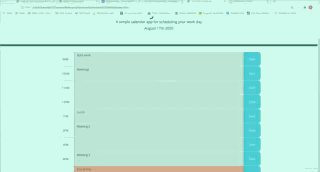
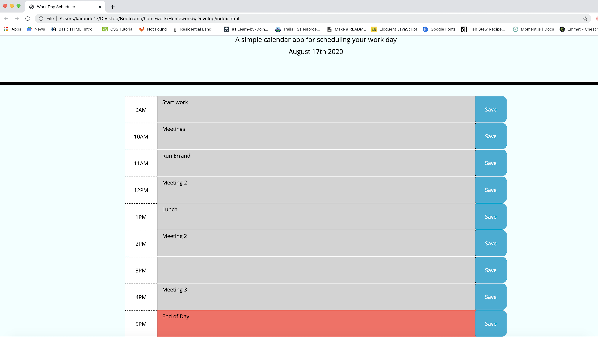

# 05 Third-Party APIs: Work Day Scheduler

The project objective is to create a calendar application that allows users to save events for each hour of the day.  For the date and time functions, I used the [Moment.js](https://momentjs.com/) library.  

The Project Acceptance Criteria are as follows: 

GIVEN I am using a daily planner to create a schedule
WHEN I open the planner
THEN the current day is displayed at the top of the calendar
WHEN I scroll down
THEN I am presented with timeblocks for standard business hours
WHEN I view the timeblocks for that day
THEN each timeblock is color coded to indicate whether it is in the past, present, or future
WHEN I click into a timeblock
THEN I can enter an event
WHEN I click the save button for that timeblock
THEN the text for that event is saved in local storage
WHEN I refresh the page
THEN the saved events persist

Process:
Using the pre-created HTML and CSS files, I created a script.js file and linked the file to the HTML in order to begin dynamically updating the HTML and CSS files using JQuery. 

In the HTML file, I added rows that will act as the calendar time blocks containing the time, user input, and a save button. 

In the script.js file, I called on the document using JQuery and set the current date using Moments.JS so the current day is displayed at the top of the calendar. 

I then added an event listener to the save button and created variables to call on its sibling elements - description and hour. The two variables created (value and time) are then saved in local storage and grabbed from local storage when the page is refreshed so user input is displayed. 

Lastly, I created a timeChecker function that enables my time blocks to change colors indicating past, present and future. 

###Final Product Demo:

####Final Product Image:

